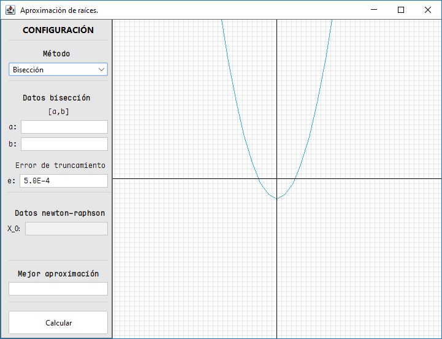
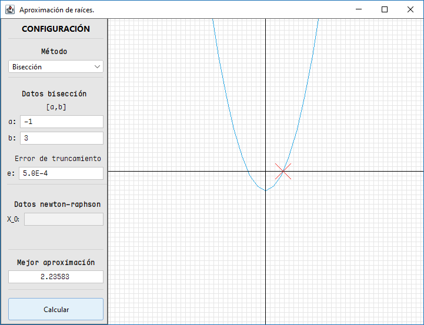
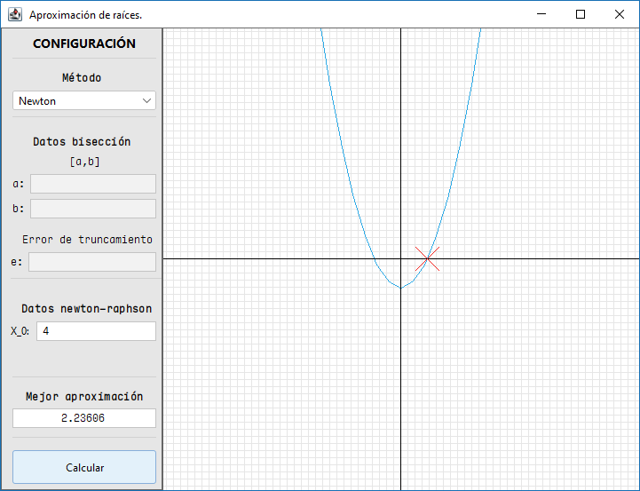

# Graficación de métodos numéricos

## Introducción

**¿Quienes somos?**  
Somos estudiantes de la Licenciatura en CIencias de la Computación en la Universidad de Sonora, México.

Nombres:
- Aguilera Luzania José Luis.
- Castro Márquez Francisco Javier.
- Monge Tinoco Manuel Crisólogo.

**Objetivo**  
El objetivo de este trabajo es demostrar el conocimiento sobre el lenguaje de programación Java desarrollando una aplicación que permita encontrar la raíz de una función usando los métodos numéricos de Bisección y Newton-Raphson, con las siguientes características:
- Debe tener un panel que muestre la gráfica de la función.
- Debe tener un panel que muestre los campos necesarios para cada método.
	- Debe tener un botón o menú para elegir el método a utilizar.
	- Cuando encuentre una raíz debe mostrar su posición en la gráfica y su valor en el panel.
	- Los campos no necesarios para el método seleccionado deben estar deshabilitados.

## Interfaz

  

## Ejemplo

**Método de Bisección**

  

**Método de Newton-Raphson**

  

